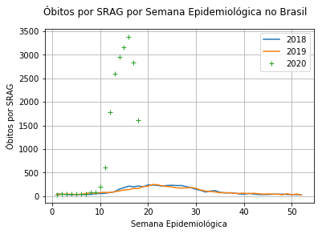
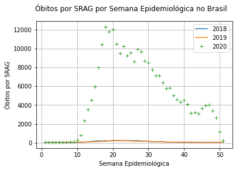
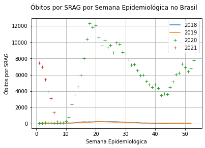
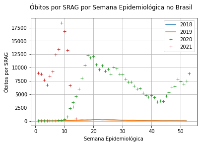
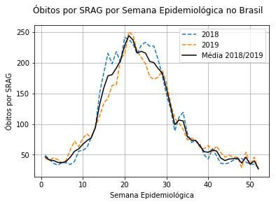
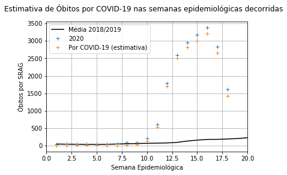
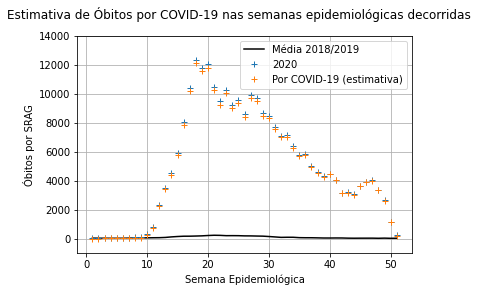
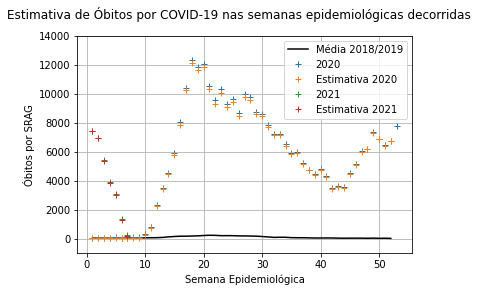
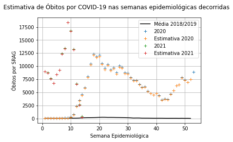

# Estimativa de mortes por COVID-19 subnotificadas no Brasil - D051 -HACKCOVID-19

(Última atualização: 03/03/2021)

  Parte 1 do desafio "IA E CIÊNCIA DE DADOS PARA APOIO A DECISÃO CLÍNICA" da *Hackathon* 'Hackcovid19' do Centro Brasileiro de Pesquisas Físicas, onde utilizamos conceitos simples de estatística, probabilidade e *datascience* para tentar estimar a quantidade de casos de mortes por Síndrome Respiratória Aguda que foram causadas por COVID-19, porém não foram reportadas como tal.

Repositório Criado por: https://github.com/adsmendesdaniel

Parte 2 do projeto: https://github.com/Gremling-Machine-Learning-Study-Group/Deep-Learning-na-analise-de-imagens-de-raio-x-para-auxilio-na-decisao-clinica-de-COVID-19

Página do projeto no Devpost: https://devpost.com/software/test_deep_covid-19#updates

Pitch para a Hackathon (Apenas vídeo): https://www.youtube.com/watch?v=8ujmJz6i4YI

**Atenção:** Este é um modelo extremamente simples para tentar estimar os óbitos subnotificados, feito em curto espaço de tempo para uma *Hackathon*. Logo, um modelo mais sofisticado poderia ser criado para se alcançarem melhores resultados e, consequentemente, se obter uma melhor confiabilidade.

## ETAPA 1: Visualizar os dados:

  Os dados utilizados nesta parte do projeto são provenientes do site: 'https://bigdata-covid19.icict.fiocruz.br/', que é administrado pelo ICICT (Instituto de Comunicação e Informação Científica e Tecnológica em Saúde) e possui relações com a Fundação Oswaldo Cruz (Fiocruz). Estes dados, por ventura, são uma fração dos dados contidos na plataforma 'InfoGripe' da Fiocruz. (Olhar referências)
  
  Inicialmente, analisaremos o *dataset* referente à mortes causadas por Síndrome Respiratória Aguda (SRAG) durante os anos 2018, 2019 e 2020 (até a 18ª semana epidemiológica). Donde podemos obter o sequinte gráfico:
  
  Gráficos antigos, com dados de 16/05/2020, 03/01/2021 e 03/03/2021, respectivamente:
  
  

  
  
  
  

  
  Gráfico atualizado (21/04/2021):
  
  

  
  

  
## ETAPA 2: Estimar uma série temporal de mortes causadas por COVID-19 (junto a problemas advindos da pandemia) a partir dos dados anteriores:

  A metodologia foi obter médias dos casos (morte por SRAG) dos anos anteriores disponíveis (2018 e 2019) e gerar uma "curva" para que, então, subtraiamos da "curva" de mortes do ano decorrente (2020), e assim obtenhamos uma nova séries temporal de pontos correspondentes à uma estimativa de mortos por SRAG causada por COVID-19. Os resultados foram os seguintes:

  

  
  

  
  Gráficos antigos, com dados de 16/05/2020, 03/01/2021 e 03/03/2021, respectivamente:
  
  

  
  
   
  

  
  Gráfico atualizado (21/04/2021):
  
  

  
  

  *Obs: é de se notar que quanto mais anos tivessemos para gerar a "curva média" mais bem comportada ela ficaria, desta forma, pode ser de senso comum que o ajuste de uma curva gaussiana poderia solucionar esse problema. Porém, desta forma correriamos o risco de perder informação que estaria contida em uma "curva média" ideal. Assim, foi decidido deixar a "curva média" da forma que está. Onde uma solução válida seria adicionar dados de anos anteriores, para que assim a "curva média" corresponda fielmente à realidade.*

## ETAPA 3: Estimar mortes subnotificadas causadas por COVID-19:

  Podemos obter a quantidade de mortes por SRAG esperadas por ano tomando a média dos pontos da curva de média de mortes dos anos 2018 e 2019. Fazendo o somatório dos valores da série temporal da média e dos casos de morte do ano de 2020 (até a 18ª semana epidemiológica) podemos obter a diferença, que corresponderá à uma estimativa do número de mortes causadas exclusivamente por fatores advindos do COVID-19.
  
  Nos *datasets* disponibilizados por ICICT/Fiocruz podemos obter a quantidade de casos de morte por SRAG registradas como COVID-19. Então podemos calcular a diferença e obter uma estimativa para a quantidade de óbitos subnotificados de COVID-19, assim como sua devida porcentagem.
  
  Os dados obtidos em todo o processo são os seguintes:
  
### RESULTADOS ANTIGOS:
  
  **Resultados obtidos em 16/05/2020:** 
  
    - Mortes decorrentes de SRAG esperadas por ano: 5403.0 
    - Mortes decorrentes de SRAG até a 18ª semana epidemiológica: 1555.0 
    - Estimativa de mortes decorrentes de COVID-19 até a 18ª semana epidemiológica: 18117.0 
    - Óbitos confirmados por COVID-19 até a 18ª semana epidemiológica: 8547.0
    - Estimativa de mortes por COVID-19 que não foram catalogadas como tal: 9570.0
    - Porcentagem de mortes por COVID-19 subnotificadas: 52.8233151% 
  
  **Resultados obtidos em 03/01/2021:**
  
    - Mortes decorrentes de SRAG esperadas por ano: 5403.0 
    - Mortes decorrentes de SRAG até a 50ª semana epidemiológica: 5336.0  
    - Estimativa de mortes decorrentes de COVID-19 até a 50ª semana epidemiológica: 252620.0
    - Óbitos confirmados por COVID-19 até a 50ª semana epidemiológica: 182110.0
    - Estimativa de mortes por COVID-19 que não foram catalogadas como tal: 70510.0 
    - Porcentagem de mortes por COVID-19 subnotificadas: 27.9114876% 

  **Resultados obtidos em 03/03/2021:**

    **Estimativas acerca de 2020:**
   
    - Mortes decorrentes de SRAG esperadas por ano: 5405.5 
    - Mortes decorrentes de SRAG em 2020: 300555.0 
    - Estimativa de mortes decorrentes de COVID-19 em 2020: 295149.5 
    - Óbitos confirmados por COVID-19 em 2020: 194976.0
    - Estimativa de mortes por COVID-19 em 2020 que não foram catalogadas como tal: 105579.0 
    - Porcentagem de mortes por COVID-19 em 2020 subnotificadas:  33.9399186% 

    **Estimativas acerca de 2021:**
  
    - Mortes decorrentes de SRAG em 2021: 28458.0 
    - Estimativa de mortes decorrentes de COVID-19 em 2021: 28170.0 
    - Óbitos confirmados por COVID-19 em 2021: 64426.0
    - Estimativa de mortes por COVID-19 em 2021 que não foram catalogadas como tal: -35968.0 
    - Porcentagem de mortes por COVID-19 em 2021 subnotificadas:  -128.7042953% 

     **Anteção:** Apesar dos resultados negativos poderem suscitar a ideia de que haja supernotificação de óbitos em 2021, é de se lembrar que há uma defasagem na atualização de de dados mais recentes, o que pode ser observado na evolução dos gráficos (quanto mais recentes as semanas, menos casos registrádos há), além de outros possíveis problemas de atualização, como informado a mim pelo Icict/Fiocruz, como represamento de dados na plataforma Infogripe. 

    **Estimativas acerca da pandemia como um todo (2020 e 2021):**
  
    - Mortes decorrentes de SRAG na pandemia: 329013.0 
    - Estimativa de mortes decorrentes de COVID-19 na pandemia: 323319.5 
    - Óbitos confirmados por COVID-19 na pandemia: 259402.0
    - Estimativa de mortes por COVID-19 na pandemia que não foram catalogadas como tal: 69611.0 
    - Porcentagem de mortes por COVID-19 na pandemia subnotificadas:  19.7691448% 

### RESULTADOS ATUALIZADOS (21/04/2021):
   
  **Estimativas acerca de 2020:**
   
  - Mortes decorrentes de SRAG esperadas por ano: 5419.0
  - Mortes decorrentes de SRAG em 2020: 307136.0 
  - Estimativa de mortes decorrentes de COVID-19 em 2020: 301717.0 
  - Óbitos confirmados por COVID-19 em 2020: 194976.0
  - Estimativa de mortes por COVID-19 em 2020 que não foram catalogadas como tal: 112160.0
  - Porcentagem de mortes por COVID-19 em 2020 subnotificadas:  35.3778541% 

  **Estimativas acerca de 2021:**
  
  - Mortes decorrentes de SRAG em 2021: 134181.0 
  - Estimativa de mortes decorrentes de COVID-19 em 2021: 133333.5 
  - Óbitos confirmados por COVID-19 em 2021: 183554.0
  - Estimativa de mortes por COVID-19 em 2021 que não foram catalogadas como tal: -49373.0
  - Porcentagem de mortes por COVID-19 em 2021 subnotificadas: -37.6653279% 

  **Anteção:** Apesar dos resultados negativos poderem suscitar a ideia de que haja supernotificação de óbitos em 2021, é de se lembrar que há uma defasagem na atualização de de dados mais recentes, o que pode ser observado na evolução dos gráficos (quanto mais recentes as semanas, menos casos registrádos há), além de outros possíveis problemas de atualização, como informado a mim pelo Icict/Fiocruz, como represamento de dados na plataforma Infogripe. 

  **Estimativas acerca da pandemia como um todo (2020 e 2021):**
  
  - Mortes decorrentes de SRAG na pandemia: 441317.0  
  - Estimativa de mortes decorrentes de COVID-19 na pandemia: 435050.5 
  - Óbitos confirmados por COVID-19 na pandemia: 374682.0
  - Estimativa de mortes por COVID-19 na pandemia que não foram catalogadas como tal: 66635.0 
  - Porcentagem de mortes por COVID-19 na pandemia subnotificadas:  13.8762052% 
  
## Referencias:

* **"MonitoraCovid-19"** https://bigdata-covid19.icict.fiocruz.br/; (Visualizado em: 16/05/2020, 03/01/2021, 03/03/2021 e 21/04/2021) (Daqui foram obtidos o *dataset* 'Casos de SRAG nos últimos anos' e 'Diagnósticos dos óbitos por SRAG').

* **"InfoGripe"** http://info.gripe.fiocruz.br/; (Visualizado em: 16/05/2020) (Donde os dados são divulgados originalmente. Daqui é possível obter *datasets* mais robustos com registros até o ano de 2009).
